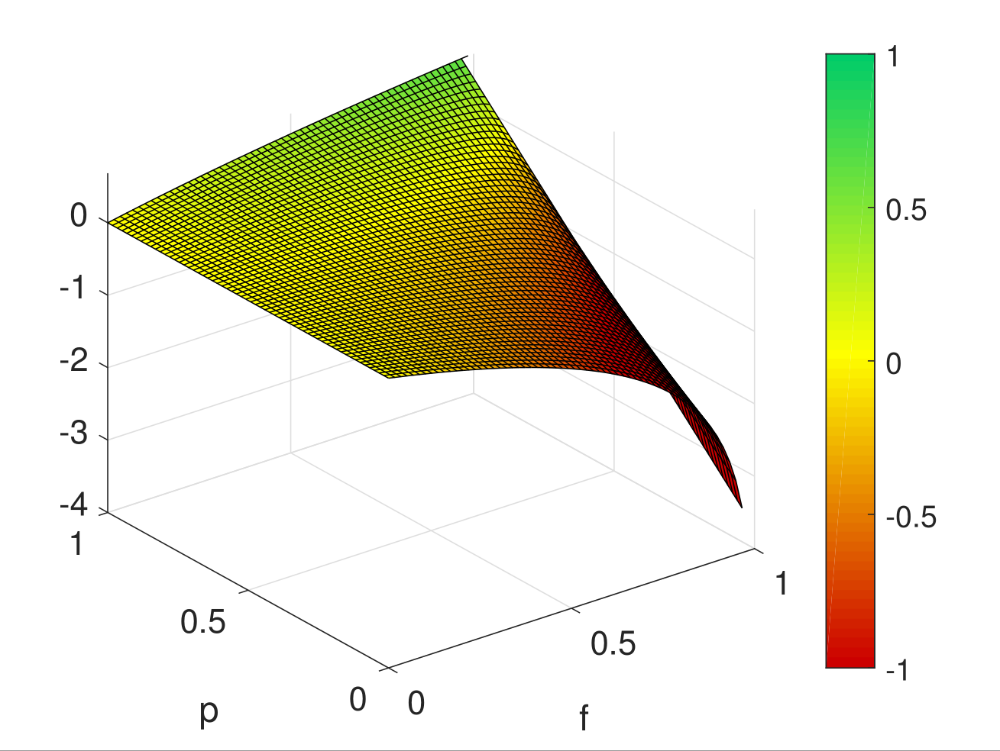

[](http://quantlet.de/)

## [](http://quantlet.de/) **Kelly_Bernoulli** [](http://quantlet.de/)

```yaml

Name of Quantlet : Kelly_Bernoulli

Published in : Metis

Description : Kelly_Bernoulli illustrates growth-optimal betting under repeated Bernoulli trials

Keywords : kelly, growth-optimal, transmission rate, blackjack, thorp

See also : Kelly_Bernoulli_GUI, Kelly_Gaussian, Stable_Kelly_Rescaling

Author : NW

Submitted : 2016-10-09

Example : 1.png, 2.png

```





### MATLAB Code:
```matlab
%% Kelly Bernoulli plots the optimal betting fraction given Bernoulli trials
% First code in 2012

%% Global commands

% ver % verify the version of Matlab
clear;clc; % clear

% set global commands for font size and line width
size_font=14;
size_line=2;
set(0,'DefaultAxesFontSize',size_font,'DefaultTextFontSize',size_font);
set(0,'defaultlinelinewidth',size_line)

%% Kelly, classic

p=0.6; %winning prob
g=@(f) (p*log(1+f)+(1-p)*log(1-f));
g_neg=@(f) -(p*log(1+f)+(1-p)*log(1-f)); %negative, due to min algo
min=fminbnd(g_neg,0,1); % min in bounds for f [0,1]

h=figure();

subplot(1,2,1)
ezplot(g)
title('');hold on;
plot(min,g(min),'d')
xlim([0 1])
grid;

subplot(1,2,2)
ezplot(g)
title('');hold on;
plot(min,g(min),'d')
xlim([0 (2*p-1)*2])
ylim([0 g(min)+0.003])
grid;
hold off;

%print(h,'-depsc','-r300','kelly_bernoulli')

%% Kelly classic g(f,p)
clear;

h=figure();
g=@(f,p) (p*log(1+f)+(1-p)*log(1-f));
k=@(f,p) 0;


ezsurf(g,[0,1,0,1]);
title('')
%ezsurf(k,[0,1,0,1])
%print(h,'-depsc','-r300','kelly_bernoulli2')

%{
mymap = [[204 0 0]
     [255 255 0]
     [0 204 102]]./255;

colormap(mymap)
caxis([-2 1])
%}

```
