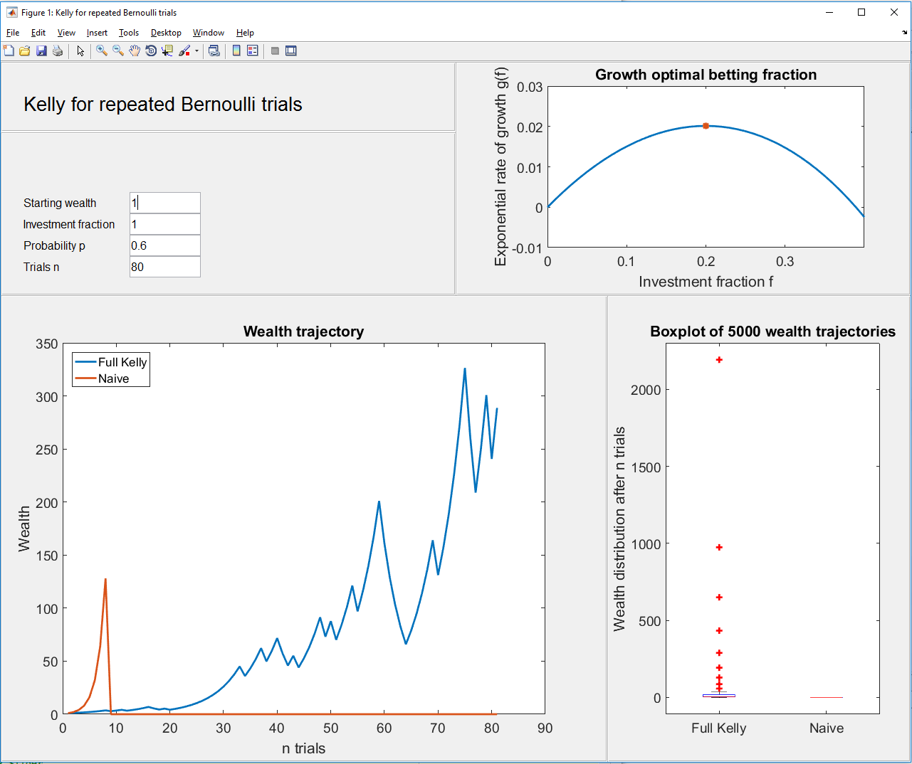
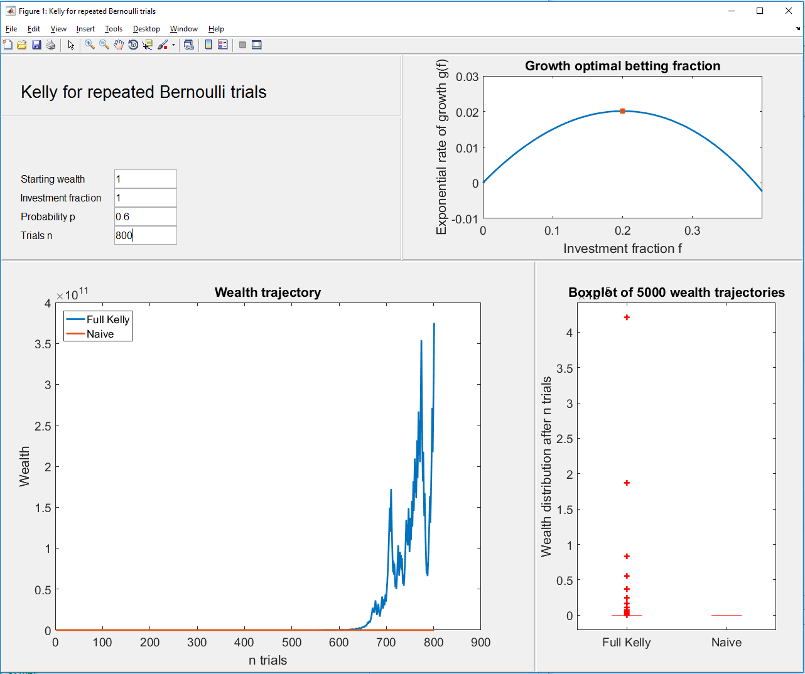

[](http://quantlet.de/)

## [](http://quantlet.de/) **Kelly_Bernoulli_GUI** [](http://quantlet.de/)

```yaml

Name of Quantlet : Kelly_Bernoulli_GUI

Published in : Metis

Description : 'Kelly_Bernoulli_GUI illustrates growth-optimal betting under repeated Bernoulli
trials. The according GUI visualizes/analyzes the Kelly trajectories.'

Keywords : kelly, growth-optimal, transmission rate, blackjack, thorp

See also : Kelly_Bernoulli, Kelly_Gaussian

Author : NW

Submitted : 2016-10-09

Example : 1.png, 2.png

```






### MATLAB Code:
```matlab
%% GUI_Kelly_Bernoulli

function GUI_Kelly_Bernoulli

%% Create GUI

% size (gui is not fully flexible so far!)
height=760;
width=900;

%  Create the UI
f = figure('name','Kelly for repeated Bernoulli trials','Visible','on','Position',[100,100,width,height]);
set(f, 'Color', [1 1 1])

% Seperation

f1=uibuttongroup('Position',[0 9/10 1/2 1/10]);
f2=uibuttongroup('Position',[0 2/3 1/2 1/3-1/10]);
f3=uibuttongroup('Position',[0 0 2/3 2/3]);
f4=uibuttongroup('Position',[2/3 0 1/3 2/3]); %,'BackgroundColor',[1 1 1]
f5=uibuttongroup('Position',[1/2 2/3 1/2 1/3]);

%% Header

distance=30;

uicontrol(f1,'Style','text','String','Kelly for repeated Bernoulli trials',...
                'Position',[distance 5 400 50],...
                'FontSize',20,'HorizontalAlignment','left');
            
         
%% Texts for scalars  

text_strings={'Starting wealth','Investment fraction','Probability p',...
    'Trials n'};

for i=1:length(text_strings)
uicontrol(f2,'Style','text','String',text_strings{i},...
                'Position',[distance 140-i*distance 200 30],...
                'FontSize',12,'HorizontalAlignment','left');
end    


%% Starting values

W_0=1; % starting wealth
p=0.6; % winning prob
n=80; % #trials
%m=5000; % trajectories
f_naive=1; % naive fraction


%% Slider

uicontrol(f2,'Style','edit','String',W_0,...
                'Position',[6*distance 145-1*distance 100 30],...
                'FontSize',12,'HorizontalAlignment','left','Callback',@s1callback);        


uicontrol(f2,'Style','edit','String',f_naive,...
                'Position',[6*distance 145-2*distance 100 30],...
                'FontSize',12,'HorizontalAlignment','left','Callback',@s2callback);            

uicontrol(f2,'Style','edit','String',p,...
                'Position',[6*distance 145-3*distance 100 30],...
                'FontSize',12,'HorizontalAlignment','left','Callback',@s3callback);   

uicontrol(f2,'Style','edit','String',n,...
                'Position',[6*distance 145-4*distance 100 30],...
                'FontSize',12,'HorizontalAlignment','left','Callback',@s4callback);               
    
%% Callbacks

function s1callback(hObject, eventdata, handles)
W_0 = str2double(get(hObject,'string'));
disp('Starting wealth')
disp(W_0)

Sim_Bernoulli(W_0,p,n,f_naive,ax1,ax2,ax3)

end
function s2callback(hObject, eventdata, handles)
f_naive = str2double(get(hObject,'string'));
disp('Investment fraction')
disp(f_naive)

Sim_Bernoulli(W_0,p,n,f_naive,ax1,ax2,ax3)

end
function s3callback(hObject, eventdata, handles)
p = str2double(get(hObject,'string'));
disp('Probability')
disp(p)

Sim_Bernoulli(W_0,p,n,f_naive,ax1,ax2,ax3)
end
function s4callback(hObject, eventdata, handles)
n = str2double(get(hObject,'string'));
disp('Trials')
disp(n)

Sim_Bernoulli(W_0,p,n,f_naive,ax1,ax2,ax3)
end

%% Figure

ax1 = axes(f3,'Units','normalized','Position',[0.1 0.1 0.8 0.8]);
ax2 = axes(f4,'Units','normalize','Position',[0.1 0.1 0.8 0.8]);
ax3 = axes(f5,'Units','normalize','Position',[0.2 0.2 0.7 0.7]);

Sim_Bernoulli(W_0,p,n,f_naive,ax1,ax2,ax3)
end
    
```
