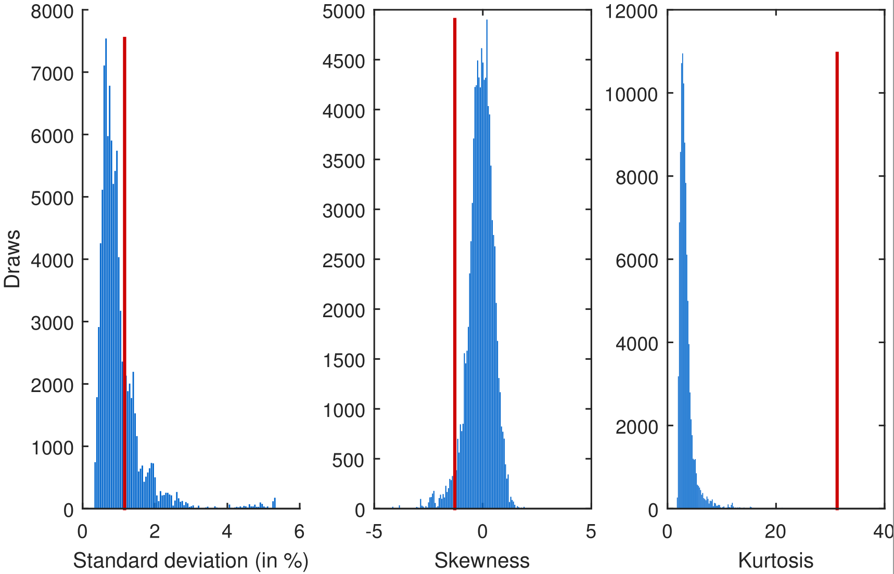

[](http://quantlet.de/)

## [](http://quantlet.de/) **Stable_Kelly_MomentDistribution** [](http://quantlet.de/)

```yaml

Name of Quantlet : Stable_Kelly_MomentDistribution

Published in : tba

Description : 'Stable_Kelly_MomentDistribution calculates a simulated distribution of sample
moments under limited data points. The goal is to show non-normal behavior for low-frequency data.'

Keywords : stable, moments, simulated distribution, levy, gaussian

See also : 'Stable_Kelly_LogDensityFinancials, Stable_Kelly_MomentIncrease, Stable_Kelly_Rescaling,
sim_stable, stable, mc_culloch, stabreg'

Author : NW

Submitted : 2016-07-04

Datafile : prices.mat

Example : 1.png

```




### MATLAB Code:
```matlab
%% Sample Size on Moments
% Starts with the textbook example of Gaussian convergence as the sampling
% frequency decreases. The arguements is conquered by the impact of data
% points on the according statistics.

%% Init

clear;clc;

%set global commands for font size and line width
size_font=9;
size_line=1.5;
set(0,'DefaultAxesFontSize',size_font,'DefaultTextFontSize',size_font);
set(0,'defaultlinelinewidth',size_line)

% figures
set(0, 'defaultFigurePaperType', 'A4')
set(0, 'defaultFigurePaperUnits', 'centimeters')
set(0, 'defaultFigurePaperPositionMode', 'auto')

% reset rngs before running
rng(1)


%% Daily Dataset if SnP500 from 1985 till 2015

load prices.mat

ret_daily=price2ret(prices); % daily log returns

n_daily=length(ret_daily)
A=n_daily;

%% Sampling n subsequent days and evaluate moments NONSTATIONARY

n=30; % sample n days
m=10^5; % m times

ret_sub_daily=nan(m,n);

S_daily=randi([1 n_daily-n],1,m);
for i=1:m
ret_sub_daily(i,:)=ret_daily(S_daily(i):1:S_daily(i)+n-1);
end

mu=nan(m,1);
sigma=nan(m,1);
kurt=nan(m,1);
skew=nan(m,1);

for i=1:m
    mu(i,:)=mean(ret_sub_daily(i,:));
    sigma(i,:)=std(ret_sub_daily(i,:));
    skew(i,:)=skewness(ret_sub_daily(i,:));
    kurt(i,:)=kurtosis(ret_sub_daily(i,:));
end

%% Plot

subplot(1,4,1)
hist(mu,100)
subplot(1,4,2)
hist(sigma,100)
subplot(1,4,3)
hist(skew,100)
subplot(1,4,4)
hist(kurt,100)

%% Subplot

line_width=1.5;

h=figure();
subplot(1,3,1)
[x,y]=hist(sigma*100,100);hold on;
bar(y,x,'facecolor',[0 102 204]./255,'EdgeColor','none')
%set(gca,'xscale','log');%,'yscale','log')
ylabel('Draws')
xlabel('Standard deviation (in %)')

line([1.16 1.16],[0 max(x)],'Color',[204 0 0]./255,'LineStyle','-','LineWidth',line_width) 

subplot(1,3,2)
[x,y]=hist(skew,100);
bar(y,x,'facecolor',[0 102 204]./255,'EdgeColor','none')
%set(gca,'xscale','log');%,'yscale','log')
%ylabel('Draws')
xlabel('Skewness')

line([-1.29 -1.29],[0 max(x)],'Color',[204 0 0]./255,'LineStyle','-','LineWidth',line_width) 


subplot(1,3,3)
[x,y]=hist(kurt,100);
bar(y,x,'facecolor',[0 102 204]./255,'EdgeColor','none')
%set(gca,'xscale','log');%,'yscale','log')
%ylabel('Draws')
xlabel('Kurtosis')

line([31.26 31.26],[0 max(x)],'Color',[204 0 0]./255,'LineStyle','-','LineWidth',line_width) 

set(h, 'PaperPosition',[2 2 17 10]) % 210*297
%print(h,'-depsc','-r300','implementation_moments_sim30')
%print(h,'-dpdf','-r0','implementation_moments_sim30')

```
